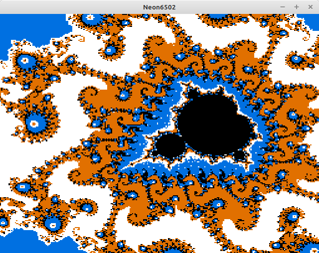
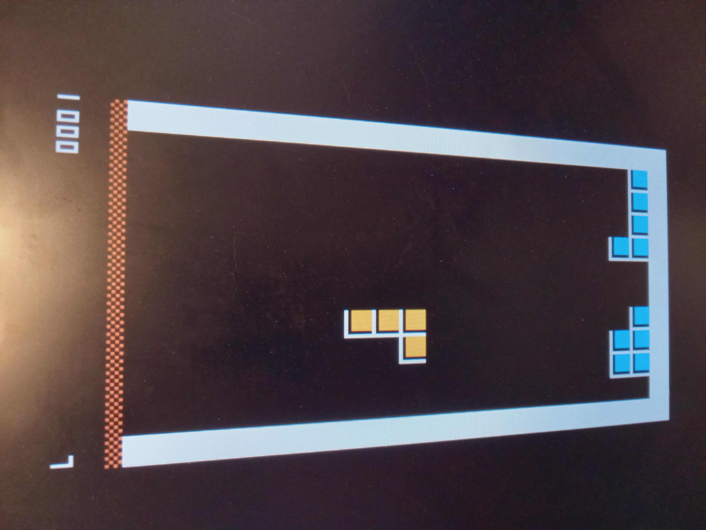
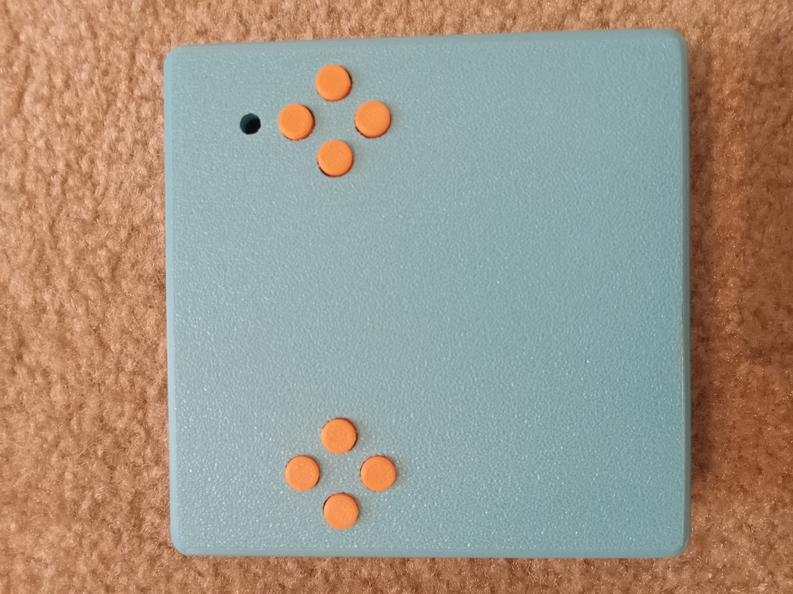
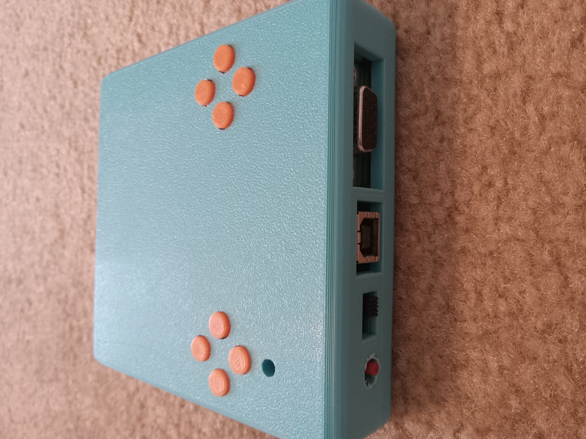

# Neon6502

<b>Compact 6502 build using 74' logic chips.</b>

The idea with this project is to make a cheap 4" x 4" PCB that can fit most of the functionality of my original <a href="https://github.com/stevenchadburrow/AcolyteComputer">Acolyte Computer</a>.  The purpose is to play games such as Tetris and Space Invaders clones that I will program in 6502 assembly.  I also made a simulator program is to help speed up development time and lessen the amount of Flash ROM burns. 

I'm doing this in order to wait for the <a href="https://www.microchip.com/en-us/product/PIC32CZ8110CA80144">PIC32CZ8110CA80144</a> microcontroller to come out in the LQFP-144 package (promised Q4 of 2025!).  Once that is out, I will get back to projects similar to my <a href="https://github.com/stevenchadburrow/AcolyteHandheld">Acolyte Handheld<a>. 

<b>Specs:</b> 
- W65C02 running at 3.14 MHz 
- 32 KB of RAM (30 KB of which is Video RAM) 
- 32 KB of ROM (4x switchable banks) 
- 8x Built-in Buttons 
- VGA Output of 320x240 in 4-colors 
- Uses only 74' logic chips and the Flash ROM to generate the video signal! 
- USB-B to power device 
- No VIA, no UART, no keyboard, no audio, no external memory 

<b>Memory Map:</b> 
- $0000 - $07FF = RAM 
- $0800 - $7FFF = Video RAM 
- $8000 - $FFFF = ROM 

<b>History:</b> 
As this is a revisiting of previous projects and skills, I feel the need to try to catalog my progress up to this point.  Below is a timeline of projects completed with a few details. 
- Aug 2021: After the quarantine, I went back to work at the school physically.  I never went upstairs into my office but stayed in my classroom with a Linux computer to occupy my time.  I started researching how to make a water-based calculator, but found electricity to be far better.  I researched about 74' logic chips and eventually reached out to Garth who redirected me to the 6502.org Forum <a href="http://forum.6502.org/">here</a>.
- Oct 2021: This marks the very beginning of the journey, my first 6502 build, called "V1" by Bill (plasmo).  Made on perf-board, each wire hand-soldered.  I had crossed A4 and A11 on the RAM, Bill found this and fixed it for me.  It had only a couple of buttons and a 16x2 LCD.
- Nov 2021: I made a duplicate of V1 on a PCB, which I called "V2".  No bodges were required, though it wasn't very useful.  Far later I would use this as the basis for a project where Elizabeth soldered her own computer together.
- Jan 2022: I made V3 and even a V4, adding features such as PS/2 keyboard and ROM banks.  I tried to add VGA video using 74' logic chips for all sync calculations, but they were all failures.
- Mar 2022: In order to create a VGA video signal, I created my "Half a Pi" board, using a dedicated Flash ROM for video signals.  It was able to output White, Red, Cyan, and Black.  I was able to showcase it at the upcoming Math Appreciation Day 2022 <a href="http://forum.6502.org/viewtopic.php?f=1&t=7092">here</a>.
- Jul 2022: By now I had tried to replicate the "Half a Pi" with more complexity, and yet I continued to have failures.  At some point I had started calling them "Acolyte", though apparently the first versions were not operational.  The main goal was to combine both the sync signals and the program code onto a single Flash ROM.  Some were successes, even if they were complex, found <a href="http://forum.6502.org/viewtopic.php?f=4&t=7154">here</a>.
- Nov 2022: At this point I was still making mistakes and a lot of my PCBs would not work.  A revelation came to be at some point here that I could simply bodge wires to fix problems, which helped a lot.  You can find a lot of the discussion <a href="http://forum.6502.org/viewtopic.php?f=4&t=7407">here</a>.
- Jan 2023: The final culmination of the original Acolyte computers comes together <a href="https://github.com/stevenchadburrow/AcolyteComputer">here</a>.  It was named "Last Acolyte II".  It has so many bodge wires, mostly for experimenting and adding a VIA into the expansion area.  The back of that board looks like spagetti with all of the bodges!  It had Tetris, Space Invaders, BASIC, and a Monitor program.
- Apr 2023: I started designing the "Serial VGA" projects <a href="https://github.com/stevenchadburrow/SerialVGA">here</a>, which could be connected to any random 6502 computer.  After some revisions they started to work, but were not very efficient, being too slow.  I also played around with the Arduino, and created a CPLD-based shield <a href="https://github.com/stevenchadburrow/ArduinoShield">here</a>.
- Sep 2023: By now I had been working with CPLDs and learning Verilog, and created what I called "New Acolyte" <a href="https://github.com/stevenchadburrow/NewAcolyte">here</a>, which ran twice as fast and relied on the CPLD for video generation with 16 colors.  I connected a Sega Genesis controller to it, and was able to create many fun games for it, including Tetris, Space Invaders, Missile Command, Rogue, and Galaga clones.
- Dec 2023: After other failed revisions, it was time to go bigger and better, and so I developed my 'masterpiece', the "Acolyte816" <a href="https://github.com/stevenchadburrow/Acolyte816">here</a>.  It used a 65816 processor, CPLD for video generation, and a PIC16 micrcontroller for bootloading.  It did work, but was so complex that it was very hard to develop for.  Because of that, not much time was spent on it.
- Feb 2024: Enticed by the PIC16 which Garth had introduced to me, I started work on a PIC18 microcontroller based computer called "Acolyte Hand PIC'd", found <a href="https://github.com/stevenchadburrow/AcolyteHandPICd">here</a>.  It was a separation from the 6502 based computers, finally breaking away and being able to use C programming.  It still using a CPLD and external RAM for video generation.  I was able to get Tetris to run on it.  I would try another PIC18 project later that failed to work because I made it too complex.
- May 2024: I created a PIC24 microcontroller based computer called "Acolyte Hand PIC'd 24" <a href="https://github.com/stevenchadburrow/AcolyteHandPICd24">here</a>.  I was final able to break away from using the CPLD and external RAM for video generation, still yielding 16 colors.  Small additions to test USB host and device capabilities were added.  Then during Summer 2024 I created a two-player Pokemon clone for this computer, pushing the PIC24 to the very limit.
- Oct 2024: I upgraded to the PIC32 microcontroller, creating a computer called the "Acolyte Hand PIC'd 32" with absolutely stunning results <a href="https://github.com/stevenchadburrow/AcolyteHandPICd32">here</a>.  I started running it at 200 MHz, displaying 256 colors.  I bodged in better audio capabilities using an R2R DAC and was able to play video/audio streams.
- Dec 2024: After trying to port an NES emulator to the PIC32 board, and failing to reach the needed speed, I found the Peanut-GB Emulator by Mahyar <a href="https://github.com/deltabeard/Peanut-GB">here</a>.  It ran Gameboy games at full speed.  I quickly made a second revision of the PIC32 board with 64K color capability and 2x 8-bit R2R DACs.
- Jan 2025: Wanting to create a handheld device of some kind, I created "Mon Catcher" using a PIC24 and a small LCD.  It was going to be a dedicated device that would act similar to Pokemon GO, using sensors to detect movement.  It worked, but the sensors were not great and I got bored of it quickly. ( No links provided. )
- Feb 2025: I started work on what would later be called "PICnes" <a href="https://github.com/stevenchadburrow/PICnes">here</a>.  By April 2025 it would have all of the popular NES mappers including MMC3.
- Jun 2025: My dream forever has been to have a 'switchable' platform, and so I finally created the "Acolyte Handheld" <a href="https://github.com/stevenchadburrow/AcolyteHandheld">here</a>.  Capable of switching between VGA and LCD outputs, and being overclocked to 300 MHz, it was able to run nearly all NES games at full speed.  Along with Peanut-GB, I added TotalSMS <a href="https://github.com/ITotalJustice/TotalSMS">here</a>, for Sega Master System and Game Gear games.  Over Summer 2025 it was finalized.
- Aug 2025: In an attempt to shrink the Acolyte Handheld down, I created what I called the "Second Handheld", which would be my 'masterpiece' with the PIC32.  Unfortunately, I was not able to overclock it to 300 MHz, and many of the complex features such as external Flash ROM I had added were not working.  It ultimately ended a failure, however beautiful it was.  It seems that my 'masterpieces' always end in failure? ( No links provided. )
- Sep 2025: Seeking to make the next project better than the PIC32, I started the "RPi02W-Emulators" project <a href="https://github.com/stevenchadburrow/RPi02W-Emulators">here</a>.  Using a Raspberry Pi Zero 2W, I was able to make it 'switchable' between and LCD screen and HDMI output.  Programming in Linux was very enjoyable, though ultimately this project also proved to be a failure.  It ran NES and GB games easily enough, but Gameboy Advance games were still too slow.  The screen would have a tearing effect and the audio was scratchy, mainly because I decided to user /dev/fb0 and /dev/dsp for all of my video and audio needs.  The Linux overhead just didn't make it work as well as I had wanted.  It does run Freedoom, but only on HDMI.
- Nov 2025: And here we are, creating "Neon6502".  There is my journey.

<b>Links:</b> 
<a href="https://www.youtube.com/shorts/nDpJQxdZJzY">Youtube Short playing Tetra</a> 

<b>Pictures:</b> 
Pictures of the PCB design, some footprints too small. Gerber files included. 
 
Testing out the image converter, assembly code, and simulator. 
 
Soldered PCB with all components.  Only one bodge wire! 
 
Actual program on VGA monitor. 
 
Tetra is always the first game. 
 
Enclosure uses same color palette. 
 
Ports fit flush with enclosure. 
 

