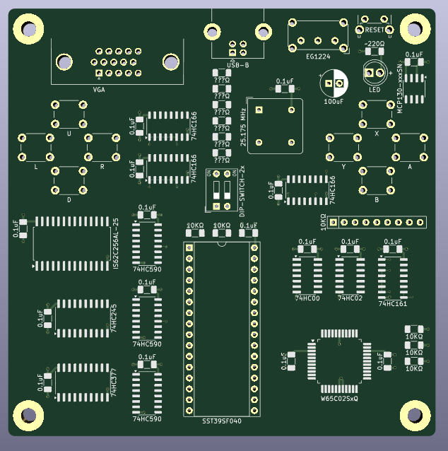

# Neon6502

<b>Compact 6502 build using 74' logic chips.</b>

The idea with this project is to make a cheap 4" x 4" PCB that can fit most of the functionality of my original <a href="https://github.com/stevenchadburrow/AcolyteComputer">Acolyte Computer</a>.  The purpose is to play games such as Tetris and Space Invaders clones that I will program in 6502 assembly.  I also made a simulator program is to help speed up development time and lessen the amount of Flash ROM burns. 

I'm doing this in order to wait for the <a href="https://www.microchip.com/en-us/product/PIC32CZ8110CA80144">PIC32CZ8110CA80144</a> microcontroller to come out in the LQFP-144 package (promised Q4 of 2025!).  Once that is out, I will get back to projects similar to my <a href="https://github.com/stevenchadburrow/AcolyteHandheld">Acolyte Handheld<a>. 

<b>Specs:</b> 
- W65C02 running at 3.14 MHz 
- 32 KB of RAM (30 KB of which is Video RAM) 
- 32 KB of ROM (4x switchable banks) 
- 8x Built-in Buttons 
- VGA Output of 320x240 in 4-colors 
- Uses only 74' logic chips and the Flash ROM to generate the video signal! 
- USB-B to power device 
- No VIA, no UART, no keyboard, no audio, no external memory 

<b>Memory Map:</b> 
- $0000 - $07FF = RAM 
- $0800 - $7FFF = Video RAM 
- $8000 - $FFFF = ROM 

<b>History:</b> 
As this is a revisiting of previous projects and skills, I feel the need to try to catalog my progress up to this point.  Below is a timeline of projects completed with a few details. 
- Oct 2021: The very first 6502 build, called "V1" by Bill (plasmo).  Made on perf-board, each wire hand-soldered.  I had crossed A4 and A11 on the RAM, Bill found this and fixed it for me.  It had only a couple of buttons and a 16x2 LCD.
- Nov 2021: I made a duplicate of V1 on a PCB, which I called "V2".
- Jan 2022: I made V3 and even a V4, adding features such as PS/2 keyboard and ROM banks.  I tried to add VGA video using 74' logic chips for all sync calculations, but they were all failures.
- Mar 2022: In order to create a VGA video signal, I created my "Half a Pi" board, using a dedicated Flash ROM for video signals.  It was able to output White, Red, Cyan, and Black.  I was able to showcase it at the upcoming Math Appreciation Day 2022.
- Jul 2022: By now I had tried to replicate the "Half a Pi" with more complexity, and yet I continued to have failures.  At some point I had started calling them "Acolyte", though apparently the first versions were not operational.  The main goal was to combine both the sync signals and the program code onto a single Flash ROM.
- Nov 2022: At this point I was still making mistakes and a lot of my PCBs would not work.  A revelation came to be at some point here that I could simply bodge wires to fix problems, which helped a lot.
- Jan 2023: The final culmination of the original Acolyte computers comes together <a href="https://github.com/stevenchadburrow/AcolyteComputer">here</a>.  It was named "Last Acolyte II".  So many bodge wires, mostly for experimenting and adding a VIA into the expansion area.  The back of that board looks like spagetti with all of the bodges!  It had Tetris, Space Invaders, BASIC, and a Monitor program.
- Apr 2023: I started designing the "Serial VGA" projects <a href="https://github.com/stevenchadburrow/SerialVGA">here</a>, which could be connected to any random 6502 computer.  After some revisions they started to work, but were not very efficient, being too slow.
- Sep 2023: By now I had been working with CPLDs and learning Verilog, and created what I called "New Acolyte" <a href="https://github.com/stevenchadburrow/NewAcolyte">here</a>, which ran twice as fast and relied on the CPLD for video generation with 16 colors.  I connected a Sega Genesis controller to it, and was able to create many fun games for it, including Tetris, Space Invaders, Missile Command, Rogue, and Galaga clones.
- 

<b>Pictures:</b> 
Pictures of the PCB, Gerber files also included. 
 
Testing out the image converter, assembly code, and simulator. 
 
